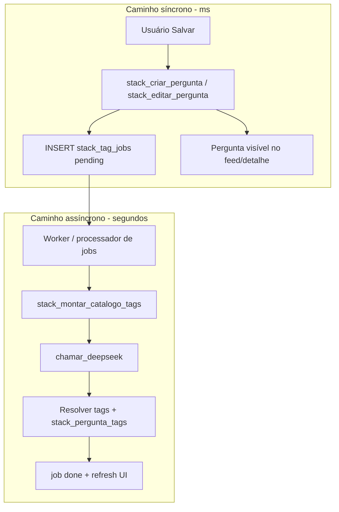

# Plano — Tags do Atende Stack com IA (DeepSeek)

Documento de arquitetura e implementação: tags geradas automaticamente, filtro por chips (referência Escalações N3) e orquestração **híbrida** no backend.

**Repositório:** Gerenciador Atende  
**Última atualização:** 2026-09-28  
**Relacionado:** [ATENDE_STACK_PLANO.md](./ATENDE_STACK_PLANO.md) · [ATENDE_STACK_OPERACAO.md](./ATENDE_STACK_OPERACAO.md) · DeepSeek ([MEMORIA_MIGRACAO_GERENCIADOR_ATENDE.md](./MEMORIA_MIGRACAO_GERENCIADOR_ATENDE.md))

**Status:** **em produção** (2026-09-28) — migrations aplicadas no Supabase remoto; frontend W3; job pg_cron `stack_processar_tag_jobs` (`*/2 * * * *`, ativo); Edge Function deployada (**opcional**). DeepSeek via Vault configurado.

---

## 1. Objetivo

Substituir tags digitadas pelo usuário por **2–3 tags** inferidas pela IA (DeepSeek), reutilizando o vocabulário existente em `stack_tags` para evitar sinônimos duplicados. Na UI:

- **Criação/edição:** sem campo de tags; usuário publica título e corpo normalmente.
- **Filtros:** apenas **chips** (selecionados + nuvem abaixo), sem caixa de texto de tags — padrão visual/comportamental das **Escalações N3** (`EscalacoesN3Modal`, sidebar de assuntos).
- **Latência zero na publicação:** a pergunta é **criada e exibida imediatamente**; tags são aplicadas **de forma assíncrona** quando o job de IA terminar.
- **Edição de conteúdo:** qualquer alteração relevante em título/corpo **dispara nova classificação** (também assíncrona).

---

## 2. Princípios de produto

| Princípio | Decisão |
|-----------|---------|
| Não bloquear o autor | Salvar pergunta **não** espera DeepSeek; respostas e joinhas podem começar antes das tags. |
| Tags são sistema | Usuário comum não envia `p_tag_ids` / `p_tag_novos`; staff pode ter ferramentas extras (regenerar, ver log) em fase posterior. |
| Vocabulário canônico | Toda tag persistida passa por `stack_tag_slug` + `stack_tag_obter_ou_criar`. |
| IA informada | Catálogo dinâmico (tags já usadas + relevantes ao texto) entra no prompt **antes** de permitir tag nova. |
| Filtro combinatório | Vários chips selecionados = **AND** (mesma semântica do filtro de assunto no N3), não OR. |
| Edição = reclassificar | Novo job quando o **corpo** (plain/HTML) mudar; tags antigas permanecem até swap atômico no worker. |
| Falha da IA | Pergunta **permanece publicada**; aplicar tag canônica **«Sem classificação»**; staff corrige manualmente ou **regenera**. |
| Staff | Pode **fixar tags manualmente** e **regenerar** classificação por IA. |
| Filtro | Vários chips = **AND** (confirmado). |

---

## 3. Estado atual (baseline)

| Peça | Hoje |
|------|------|
| Tabelas | `stack_tags`, `stack_pergunta_tags` |
| Create | `stack_criar_pergunta(..., p_tag_ids, p_tag_novos)` |
| UI | `StackTagField` + autocomplete; filtros com input em `StackFiltrosPanel` |
| Filtro SQL | `tag_id IN (...)` → **OR** |
| IA | `public.chamar_deepseek` (Vault); padrão JSON em classificação de scripts |

---

## 4. Arquitetura híbrida (aceita)

**Híbrido recomendado:** o **cliente** não define tags na criação/edição comum. O **Postgres** (RPCs `SECURITY DEFINER`) monta catálogo, chama `chamar_deepseek`, valida JSON e persiste tags. Jobs longos rodam **fora** do caminho síncrono de “Salvar”.



### 4.1 Por que job assíncrono

- Evita timeout do PostgREST e UX “Salvando…” longo.
- Alinha com requisito: **interação imediata** na pergunta sem tags.
- Permite retry, observabilidade e rate limit por fila.

### 4.2 Quem executa o worker (opções)

| Opção | Descrição | Preferência |
|-------|-----------|-------------|
| **W1 — Edge Function + cron** | Função `stack-process-tag-jobs` invocada a cada N segundos ou via `pg_cron` HTTP | Produção Supabase |
| **W2 — pg_cron + SQL** | Job SQL chama helper que processa 1 linha (se `http` extension ok dentro do batch) | Ambiente com extensão estável |
| **W3 — Cliente “gentil”** | Após create, front chama `stack_processar_tag_job(id)` uma vez (best-effort) | **Complemento** a W1/W2, não substituto |

**Recomendação:** W1 como fonte da verdade; W3 opcional para reduzir latência percebida quando o usuário ainda está com o modal aberto.

---

## 5. Modelo de dados (novo)

### 5.1 `stack_tag_jobs`

Fila de classificação por pergunta.

| Coluna | Tipo | Notas |
|--------|------|--------|
| `id` | uuid PK | |
| `pergunta_id` | uuid FK → `stack_perguntas` ON DELETE CASCADE | |
| `status` | text | `pending` \| `processing` \| `done` \| `failed` |
| `motivo` | text | `criacao` \| `edicao` |
| `content_hash` | text | Hash de `(titulo, corpo_plain)` para idempotência / cancelar jobs obsoletos |
| `tentativas` | int | default 0 |
| `ultimo_erro` | text | nullable |
| `catalogo_snapshot` | jsonb | nullable; tags enviadas à IA (debug) |
| `resposta_ia` | jsonb | nullable |
| `tags_resolvidas` | uuid[] | nullable; resultado final |
| `created_at` | timestamptz | |
| `started_at` | timestamptz | nullable |
| `finished_at` | timestamptz | nullable |

**Índices:** `(status, created_at)` onde `status = 'pending'`; `(pergunta_id, created_at DESC)`.

**Regra de concorrência:** ao enfileirar job novo para `pergunta_id`, marcar jobs `pending` anteriores da mesma pergunta como `superseded` (novo status) ou cancelar — só o job com `content_hash` mais recente aplica tags.

### 5.2 `stack_perguntas` (coluna opcional v1)

| Coluna | Tipo | Notas |
|--------|------|--------|
| `tags_status` | text | `none` \| `pending` \| `ready` \| `failed` — denormalizado para feed/detalhe sem join pesado |

Atualizar em: create (`pending`), job success (`ready`), job fail (`failed`), pergunta sem tags ainda (`pending` ou `none`).

### 5.3 Sem mudança em `stack_tags` / `stack_pergunta_tags`

Continuam como fonte canônica e FTS (`stack_perguntas_refresh_search_vector` após aplicar tags).

---

## 6. RPCs e contratos

### 6.1 Escrita (síncrona — sem tags do client)

**`stack_criar_pergunta_v2`** (ou evolução da RPC atual com breaking change documentado)

```text
(p_titulo text, p_corpo_html text, p_autor_equipe_id uuid DEFAULT NULL)
RETURNS jsonb  -- { pergunta_id, tags_status: 'pending' }
```

- Validações atuais (título/corpo mínimos, HTML seguro).
- INSERT pergunta; **não** insere `stack_pergunta_tags`.
- `tags_status := 'pending'`.
- INSERT `stack_tag_jobs` (`motivo = 'criacao'`, `content_hash`).
- **Não** chama DeepSeek nesta RPC.

**`stack_editar_pergunta_v2`**

```text
(p_pergunta_id, p_titulo, p_corpo_html)  -- sem parâmetros de tag
RETURNS void
```

- UPDATE conteúdo + metadados de edição (comportamento atual).
- Se o **corpo** (`corpo_html` / plain) mudou: enfileirar job `motivo = 'edicao'`; `tags_status := 'pending'`. Mudança **somente de título** não dispara job (decisão de produto).
- **Não** remove tags antigas até o job **concluir** (evita flicker vazio no detalhe). Alternativa aceitável: remover tags antigas e mostrar placeholder “Classificando…” — ver §8 UI.

**Deprecação:** `p_tag_ids` / `p_tag_novos` ignorados para usuário comum.

**Staff (RPCs dedicadas):**

- `stack_staff_definir_tags(p_pergunta_id, p_tag_ids, p_tag_novos)` — substitui links; `tags_status := 'ready'`; cancela jobs `pending` da pergunta.
- `stack_regenerar_tags(p_pergunta_id)` — enfileira job IA (`motivo = 'regeneracao'`); `tags_status := 'pending'`; tags atuais mantidas até swap (igual edição).

### 6.2 Catálogo e IA (assíncrona — worker)

**`stack_montar_catalogo_tags`**

```text
(p_titulo text, p_corpo_plain text, p_limit int DEFAULT 120)
RETURNS jsonb
```

- Apenas tags **em uso** (`stack_pergunta_tags`, `uso_count > 0`); exclui `sem-classificacao` e resquícios de perguntas apagadas (migration `20260928150000`).
- Top por `uso_count` + relevância trigram (`idx_stack_tags_rotulo_trgm`) a partir do título/plain.
- Formato: `[{ id, rotulo, slug, uso_count }, ...]`.

**`stack_processar_proximo_tag_job`** (ou por `p_job_id`)

- `FOR UPDATE SKIP LOCKED` em job `pending`.
- Monta catálogo → monta prompt → **`chamar_deepseek`** (`deepseek-v4-flash`, `temperature: 0.1`, JSON).
- Pós-processamento (§7) → `stack_tag_obter_ou_criar` / ids existentes.
- Transação: substituir links `stack_pergunta_tags` da pergunta; `stack_perguntas_refresh_search_vector`; `tags_status := 'ready'`; job `done`.
- Falha: incrementar `tentativas`; se `< max`, voltar `pending`; senão aplicar tag **`Sem classificação`** (`stack_tag_obter_ou_criar`), `tags_status := 'failed'`.

**`stack_sugerir_tags_ia`** (opcional, staff/debug)

- Mesmo pipeline sem persistir; útil para QA.

### 6.3 Leitura — nuvem de filtros

**`stack_listar_tags_nuvem`**

```text
(p_limit int DEFAULT 200)
RETURNS jsonb  -- [{ id, rotulo, slug, uso_count }, ...] ORDER BY uso_count DESC
```

- Só tags com **`uso_count > 0`** (pergunta ainda vinculada). Tags órfãs não aparecem no painel de filtros.
- Front (`StackTagChipFilter`) também descarta `uso_count === 0` por defesa em profundidade.

Substitui autocomplete por texto no painel de filtros.

### 6.4 Tags órfãs (catálogo)

Excluir uma pergunta remove vínculos em `stack_pergunta_tags` (`ON DELETE CASCADE`), mas **não** apaga a linha em `stack_tags`. Sem limpeza, a tag reaparecia na nuvem com contagem 0 e ainda entrava no catálogo enviado à IA.

**`stack_purge_tags_orfas()`** (interna, sem GRANT para `authenticated`):

- `DELETE` em `stack_tags` sem linha em `stack_pergunta_tags`, **exceto** `slug = 'sem-classificacao'`.
- Retorna quantidade removida.
- Disparada automaticamente após **`stack_deletar`** e **`stack_aplicar_tags_pergunta`** (create/edit/reclassificação IA, staff fixar tags, fallback).
- Migration `20260928150000` executa um purge único na aplicação.

**Operação manual** (wipe SQL direto, restore parcial): `npm run stack:delete-unused-tags` — ver [ATENDE_STACK_OPERACAO.md](./ATENDE_STACK_OPERACAO.md).

### 6.5 Filtro feed/busca — AND

Alterar `stack_feed_where` (e busca agrupada):

- Para cada `tag_id` em `filtros.tag_ids`, exigir linha em `stack_pergunta_tags`.
- Equivalente a `filtrarEscalacoesPorAssuntoELocal` no N3 (`every` tag selecionada).

Documentar breaking change no help (`StackHelpModal`).

---

## 7. Pipeline de IA (detalhe)

### 7.1 Prompt

- **System:** classificador interno; **exatamente 2 ou 3** tags; preferir catálogo; nova tag só se necessário; tags curtas; não duplicar temas já cobertos por slug/rotulo listado.
- **User:** título, plain (truncado ~4000 chars), `catalogo_tags` JSON.

### 7.2 Resposta JSON

```json
{
  "tags": [
    { "modo": "existente", "id": "uuid-opcional" },
    { "modo": "existente", "rotulo": "Precatórios" },
    { "modo": "nova", "rotulo": "Homologacao-SMAX" }
  ]
}
```

Parser tolerante a markdown fences (mesmo padrão de `useAutoScriptClassification`).

### 7.3 Pós-processamento (determinístico)

1. Validar 2–3 tags; uma retry de IA se inválido.
2. Resolver `existente` por id → rotulo → slug.
3. `nova` → `stack_tag_obter_ou_criar`.
4. Dedupe por `tag_id`.
5. Opcional v2: trigram ≥ limiar → forçar tag existente.

### 7.4 Segurança e custo

- Enviar **plain** (`stack_html_to_plain`), não HTML.
- Rate limit: **30** jobs/usuário/hora (última hora) via `stack_enqueue_tag_job` + `autor_id` da pergunta (migration `20260928140000`).
- Purge de tags órfãs (§6.4) reduz ruído no catálogo e evita chips “fantasma” no filtro.
- Log em `catalogo_snapshot` / `resposta_ia` para auditoria staff.

---

## 8. Frontend

### 8.1 Remover entrada manual de tags

| Arquivo | Mudança |
|---------|---------|
| `AtendeStackModal.tsx` | Remover `tagsDraft`, `StackTagField`; create/edit só título + corpo |
| `StackTagField.tsx` | Deprecar ou restringir a ferramentas staff |

### 8.2 Estados visuais de tags

| Contexto | Sem tags ainda | `tags_status = pending` | `ready` | `failed` |
|----------|----------------|-------------------------|---------|----------|
| Feed (lista) | meta sem chips | opcional: “···” ou chip ghost “Tags…” | chips normais (max 2 + contador) | idem ready ou ícone discreto |
| Detalhe | — | linha “Classificando tags…” (skeleton chips) | chips read-only | chip **Sem classificação**; staff: **Regenerar** / **Editar tags** |

**Atualização automática quando tags ficam prontas:**

- Se modal aberto na pergunta: poll leve `stack_obter_pergunta` a cada 3–5s enquanto `tags_status = pending`, ou Supabase Realtime em `stack_perguntas` / `stack_pergunta_tags` (fase 2).
- Feed: refresh ao refetch natural (focus, paginação) + invalidar item após poll local opcional.

### 8.3 Filtros — `StackTagChipFilter` (novo)

Espelho N3 (sidebar assuntos ~L2182–2244 em `EscalacoesN3Modal.tsx`):

1. **Chips ativos** — `filtros.tag_ids`; clique × remove.
2. **Nuvem** — `stack_listar_tags_nuvem`; toggle adiciona/remove id; contagem por tag; busca **opcional** só para reduzir nuvem (sem criar tag).
3. Integrar em `StackFiltrosPanel` **no lugar** do `<input>` de filtro por tag.

### 8.4 Serviços

- `atendeStackService.ts`: `stackCriarPerguntaV2`, `stackEditarPerguntaV2`, `stackListarTagsNuvem`.
- Opcional: `stackProcessarTagJob(jobId)` best-effort pós-save (W3).

---

## 9. Fluxos resumidos

### 9.1 Nova pergunta

1. Usuário → Salvar.
2. RPC v2 → pergunta id + `tags_status: pending`.
3. UI → detalhe/feed **imediato**; placeholder de tags se desejado.
4. Worker processa job → tags gravadas → FTS atualizado → `tags_status: ready`.
5. UI → poll/realtime → chips aparecem.

### 9.2 Editar pergunta

1. Usuário → Salvar edição.
2. RPC v2 → conteúdo atualizado; se **corpo** mudou → novo job; `tags_status: pending`.
3. Tags **anteriores permanecem** até swap atômico no worker (inclui tag «Sem classificação» se era fallback).
4. Worker → substitui `stack_pergunta_tags` + refresh search vector.

### 9.3 Falha persistente da IA

- Pergunta **já está no ar**; não bloquear save.
- Worker esgotou tentativas → associar tag canônica **«Sem classificação»** (slug `sem-classificacao`); `tags_status: failed`.
- Staff: **Regenerar tags** (`stack_regenerar_tags`) ou **Fixar tags** (`stack_staff_definir_tags`).

### 9.4 Tag «Sem classificação»

- Criada uma vez no catálogo (`stack_tags`) via migration/seed ou `stack_tag_obter_ou_criar` no primeiro fallback.
- **Não** entra no prompt da IA como tag desejável; é estado operacional, não tema de conteúdo.
- Filtro por chips: aparece na nuvem com contagem; staff usa para achar perguntas pendentes de classificação.

---

## 10. Fases de implementação

| Fase | Entrega | Critério de aceite |
|------|---------|-------------------|
| **F0** | `stack_listar_tags_nuvem` + filtro **AND** + `StackTagChipFilter` | Filtro N3-like sem input de tag; combinação de chips restringe feed |
| **F1** | Tabela `stack_tag_jobs` + `tags_status` + RPCs v2 create/edit + worker W1 | Criar pergunta < 2s; tags aparecem em até ~2 min sem bloquear save |
| **F2** | Reclassificação se **corpo** mudar + jobs obsoletos + poll UI + fallback «Sem classificação» | Editar corpo reclassifica; falha IA → tag genérica |
| **F3** | Staff definir/regenerar tags, log, rate limit, Realtime opcional | Staff fixa ou regenera; abuse mitigado |
| **F4** | Aliases / merge trigram agressivo | Redução medida de tags quasi-duplicadas |

---

## 11. Testes

| Tipo | Caso |
|------|------|
| SQL | Job superseded; AND com 2 tag_ids; slug canônico |
| Integração | Mock `chamar_deepseek` → 2 tags existentes + 1 nova |
| E2E | Create → responder antes das tags → tags surgem no detalhe |
| E2E | Edit corpo → tags atualizadas; edit só título → tags inalteradas |
| E2E | IA falha → «Sem classificação»; staff regenera |
| Seed | Demo: staff `stack_staff_definir_tags` ou processar jobs; não depender de tags manuais no create comum |

---

## 12. Decisões fechadas / em aberto

**Fechadas (produto — 2026-09-28):**

| # | Tema | Decisão |
|---|------|---------|
| 1 | Filtro multi-tag | **AND** |
| 2 | Falha da IA | Publicar normalmente; tag **«Sem classificação»**; staff manual ou regenerar |
| 3 | Reclassificação | Sempre que o **corpo** mudar (não só título) |
| 4 | Staff | Fixar tags manualmente **e** regenerar |
| — | Tagging | **Assíncrono**; save não espera IA |
| — | UX filtro | Chips estilo **N3**, sem input de tag |
| — | Swap na edição | Tags antigas até job concluir (swap atômico) |
| — | Orquestração | **Híbrida assíncrona** (§15) — create/edit enfileiram; IA só no worker Postgres |

**Implementação técnica (fechado):**

1. Poll **4s** no detalhe enquanto `tags_status = pending` (sem Realtime na v1).
2. **W3** + **pg_cron** ativos em produção; Edge Function + `STACK_TAG_CRON_SECRET` **não obrigatórios**.

---

## 15. Opção 5 — Onde roda a IA? (RPC única vs duas chamadas)

Pergunta original: **RPC única longa (C)** vs **duas chamadas (B + create blindado)**.

No nosso desenho **assíncrono**, a comparação útil é esta:

### A) Híbrido assíncrono (escolhido)

| Etapa | O quê |
|-------|--------|
| 1 | `stack_criar_pergunta` / `stack_editar_pergunta` — só persiste conteúdo + **enfileira job** (milissegundos) |
| 2 | `stack_processar_tag_job` (worker) — catálogo + **`chamar_deepseek`** + grava tags no Postgres |

Opcional: o front chama (2) logo após (1) (**W3**) para não esperar cron.

**Vantagens:** save rápido; usuário interage antes das tags; IA e chave **só no servidor**; usuário não envia tags falsas; retries e fila no banco; alinhado ao Pasquale (DeepSeek via RPC, não no browser).

**Desvantagens:** tags aparecem com atraso; exige fila/worker e estados (`pending` / `failed`); um pouco mais de SQL e observabilidade.

### B) Duas chamadas com IA no **cliente**

| Etapa | O quê |
|-------|--------|
| 1 | Front chama `stack_montar_catalogo_tags` |
| 2 | Front chama `chamar_deepseek` (via Supabase RPC) |
| 3 | Front chama `stack_criar_pergunta` passando `tag_ids` |

**Vantagens:** create RPC simples; debug da resposta IA no DevTools; sem fila na v1.

**Desvantagens:** **save depende da IA** (ou create sem tags e fica igual ao assíncrono sem fila); risco de **bypass** se create aceitar tags do client; lógica duplicada (parse JSON no TS e no SQL); pior para “corpo mudou → reclassificar” (dois caminhos).

**Veredito:** descartado para o fluxo principal; no máximo reutilizar parse JSON no TS só em ferramenta staff/debug.

### C) RPC única **síncrona** (create + IA na mesma função)

| Etapa | O quê |
|-------|--------|
| 1 | `stack_criar_pergunta` insere pergunta **e** chama DeepSeek **antes de retornar** |

**Vantagens:** contrato único; impossível criar pergunta “sem passar pela IA” na mesma transação.

**Desvantagens:** **contradiz** requisito de não esperar tags; timeout PostgREST (120s); UX “Salvando…” longa; bloqueia respostas rápidas.

**Veredito:** **descartado**.

### Resumo

| Abordagem | Save rápido | Tags assíncronas | Integridade | Complexidade |
|-----------|-------------|------------------|-------------|--------------|
| **A Híbrido assíncrono** | Sim | Sim | Alta | Média |
| B Cliente + create c/ tags | Não* | Não | Baixa sem validação | Média |
| C RPC única síncrona | Não | Não | Alta | Baixa |

\*Salvo create sem tags + segundo passo, convergindo para A.

**Implementação:** seguir **A**, com **W3** (front chama `stack_processar_tag_job` para a pergunta recém-criada/editada) + worker/cron em produção.

---

## 13. Referência N3 (gerenciador-chamados)

| Conceito N3 | Equivalente Stack |
|-------------|-------------------|
| `assunto` string `tag1; tag2` | `stack_pergunta_tags` normalizado |
| `filtroAssunto` Set + AND | `filtros.tag_ids` + SQL AND |
| Sidebar chips + contagem | `stack_listar_tags_nuvem` + `StackTagChipFilter` |
| Autocomplete na criação | **Removido** — substituído por IA assíncrona |

---

## 14. Checklist pós-implementação

- [x] [ATENDE_STACK_OPERACAO.md](./ATENDE_STACK_OPERACAO.md) — tags IA, pg_cron, smoke.
- [x] Link no [ATENDE_STACK_PLANO.md](./ATENDE_STACK_PLANO.md).
- [x] `StackHelpModal` — tags automáticas, filtro AND.
- [x] Supabase remoto: migrations `20260928120000`, `20260928130000`, `20260928140000`, `20260928150000`.
- [x] pg_cron: job `stack_processar_tag_jobs` verificado (ativo, batch 2, */2 min).
- [ ] `STACK_TAG_CRON_SECRET` — **omitir** salvo uso da Edge Function por HTTP.
